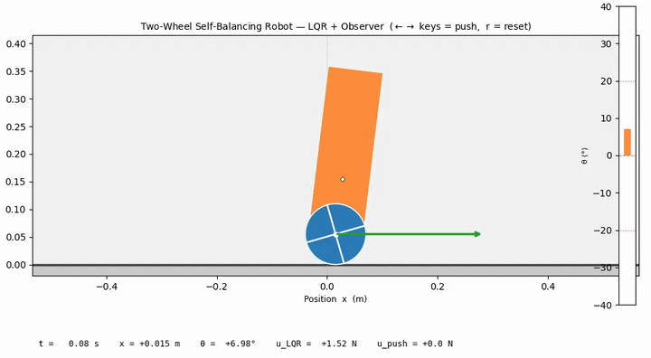

# Modeling, State-Feedback Control, and Observer Design for a Two-Wheeled Self-Balancing Robot (TWSBR)

**Course:** MEC 560 — Advanced Control Systems, Spring 2026  
**Instructor:** Dr. Amin Fakhari, Stony Brook University  
**Author:** Vahid Danesh  
**Report:** [`Project_Report.pdf`](doc/MEC_560_Final_Project_Report.pdf)

---

## Overview

This project applies linear systems theory to a two-wheeled self-balancing robot (TWSBR) modeled as an inverted pendulum on a wheeled cart. The full pipeline — nonlinear modeling, LQR control, Luenberger observer design, and robustness analysis — is implemented in Python.

---

## Repository Structure

```
├── code/
│   ├── parameters.py     # Physical constants (single source of truth)
│   ├── model.py          # Nonlinear equations of motion
│   ├── linearize.py      # Linearized A, B, C, D matrices
│   ├── analysis.py       # Controllability, observability, eigenvalues
│   ├── controller.py     # LQR, tracking, feedback linearization
│   ├── observer.py       # Full-order and reduced-order observers
│   ├── simulate.py       # solve_ivp wrappers and plotting
│   ├── robustness.py     # Parameter sweep and saturation tests
│   ├── plot_utils.py     # Shared figure style and save helpers
│   ├── main.py           # Runs all phases (Phase I–III)
│   ├── main.ipynb        # Jupyter notebook version of main.py
│   ├── animate.py        # Interactive real-time animation
│   └── plots/            # Saved figures (PDF + PNG)
├── doc/
│   └── MEC_560_Final_Project_Report.pdf
│       
└── README.md
```

---

## Setup

```bash
pip install numpy matplotlib scipy python-control
```

Python 3.9+ is recommended.

---

## Running the Code

**Run all phases (Phase I–III) and generate all plots:**
```bash
python code/main.py
```

**Launch the interactive animation:**
```bash
python code/animate.py
# Optional: set initial tilt angle
python code/animate.py --theta0 0.25
```

**Open the notebook:**
```bash
jupyter notebook code/main.ipynb
```

---

## Interactive Animation

`animate.py` renders a real-time side-view of the robot with the LQR controller and full-order observer running at each frame.

| Key | Action |
|-----|--------|
| `←` / `→` | Apply ±5 N external disturbance |
| `r` | Reset robot to upright (θ₀ = 0.15 rad) |
| `q` / `Esc` | Quit |

A live readout displays position, tilt angle, and applied forces. A tilt gauge turns red when `|θ| > 20°`.


---

## Results Summary

| Phase | Description |
|-------|-------------|
| I | Nonlinear EOM, linearization, controllability/observability, open-loop poles |
| II | LQR stabilization, step/sinusoidal tracking, full- and reduced-order observers, Separation Principle |
| III | Robustness sweep (±20% in *m* and *L*), actuator saturation (±10 N) |

All generated figures are saved to `code/plots/`.

---

## Physical Parameters

| Symbol | Description | Value |
|--------|-------------|-------|
| *M* | Wheel + base mass | 0.5 kg |
| *m* | Body mass | 0.2 kg |
| *L* | Wheel axis to CoM | 0.1 m |
| *I* | Body moment of inertia | 0.006 kg·m² |
| *b* | Rolling friction | 0.1 N·m·s |

---

## Reference

Hespanha, J. P. — *Linear Systems Theory*, 2nd Ed., Princeton University Press, 2018.
